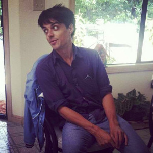

# Ptolemy Barnes

I am a full-stack web-developer with a passion for outside-in, behaviour driven, development. 
I aspire to write clean, lean, and modular code. In December '14 I began a 12-week immersive web-development
course at [Makers Academy](http://www.makersacademy.com) in Shoreditch, London, during which I met a lot of amazing people, wrote a lot of code, won a Hackerthon, and worked with local clients on real projects.

When the weather's fine I like to be outdoors, preferably on a bike. I have competed internationally
in volleyball, ultimate frisbee, and football. Since co-founding a sadly unprofitable
bagel start-up, I have been an amateur baker in search of the perfect rise.

## Selected Portfolio

| Project Repo | Deployed at | Description |
| ------------ | ----------- | ----------- |
| [IAmMe](https://github.com/ciawalsh/iamME) | [IAmME.com](http://i-am-me.herokuapp.com/) | MA Final project from Team IAmMe: myself, [Danielle](http://www.github.com/ddemkiw), [Charlie](http://www.github.com/ciawalsh), [India](http://www.github.com/indiadearlove) and [Gus](https://github.com/guspowell). Tired of trawling irrelevant content to find out what to do on the weekend? IAmME is an event-discovery platform with the form of a calendar. |
| [Makerbot](https://github.com/jacobmitchinson/MakerBot) | (MakerBot is currently in hiding) | A Slack bot replete with more API wrappers than you can "HELLO WORLD!" at. Designed to sit in the Makers Academy Slack channel, MakerBot offers useful advice to students.
| [TillTechTest](https://github.com/ptolemybarnes/ma-wk12-till-tech-test) | [TTT on Heroku](https://till-tech-test.herokuapp.com/) | A modelling of a receipt-printing till, written as a mock-tech-test on completion of Makers Academy WDI. |
| [Frontliners](https://github.com/ptolemybarnes/frontliners-api) | Offline, having been rebuilt in Scala | An API built as part of the UN Influx Hackerthon, February '15. Awarded the "Hearts" prize by a panel of judged including a former UN Deputy Secretary General |

## Technical Skills

<table>
  <tr>
    <td>
    <h4>Methodology</h4>
    </td>
    <td>
    Test-Driven Development (TDD)
     Behavior-Driven Development (BDD)
     Agile Methodology & Best Practices
     SOLID Design Principles
     Pair Programming
     Version Control with Git
    </td>
  </tr>
  <tr>
    <td><h4>Languages</h4></td>
    <td>
      Ruby
       Javascript
       Korean
    </td>
  </tr>
  <tr>
    <td><h4>Frameworks</h4></td>
    <td>
      Sinatra
       Rails
       ExpressJS on NodeJS
    </td>
  </tr>
  <tr>
    <td><h4>Test Frameworks</h4></td>
    <td>
      RSpec
       Cucumber
       Capybara
       Mocha
       Chai
       Jasmine
    </td>
  </tr>
  <tr>
    <td><h4>Front-End Skills</h4></td>
    <td>
      HTML5
       CSS3
       jQuery
       AJAX
       Handlebars
       Heroku
       ERB, EJS, Slim, HAML.
    </td>
  </tr>
   <tr>
    <td><h4>Databases and ORMs</h4></td>
    <td>
      PostgresQL
       Datamapper
       ActiveRecord
       MongoDB
    </td>
  </tr>
</table>

## Non-Technical Skills

#### Teaching/Coaching
I have extensive experience teaching students from the ages of 8 - 70. I worked for 2.5 years as an English teacher and tutor in the Republic of Korea.
Prior to this I trained for the CELTA, a teaching qualification run by Cambridge University.
On graduation from Makers Academy I was invited back to work as a support coach. 

#### Writing 
I have excellent writing skills, with articles on environmental issues on the Korean peninsula published by the Jeju Weekly, an English-language newspaper on Jeju Island, ROK.

#### Other Qualifications 
I have a NAUI Scuba Diver's license.

## Academic Background

#### The University of Sheffield, Sheffield (2010 - 2011) 
MA, Historical Research (Distinction). My MA thesis on the philosophy of history was awarded the 
George Richard Potter prize, given to the highest-graded MA thesis of the academic year. 

#### The University of Sheffield, Sheffield (2007 - 2010) 
BA, History (First Class Honours).

## Work Experience

* Coach, Makers Academy, Shoreditch, London (March '15 - Present)
* Immersive English Teacher, Jeff's Academy, Jeju City, ROK (2013 - '14) 
* English Language Instructor, ShinJeju Foreign Language Education Center, Jeju City, ROK (2012 - '13) 
* Draughtsman (part-time), Indigo Design Architects, Brighton, UK (2006 - 2011) 

